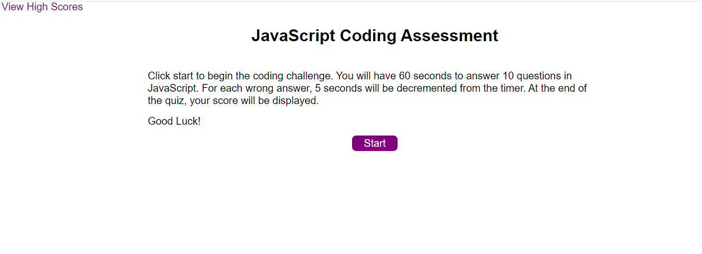

# coding-assessment

## Description
Timed JS coding quiz to assess a users JS skills

## Usage
This application will provide a timed JavaScript coding assessment. The home screen will show a short description of the application, and clicking on the start button will show a sixty second timer in the upper right corner and start the timer.  The user will be shown the first of ten JavaScript questions. Each question will  have four multiple choice options to select the answer. On answer selection, if the correct answer is selected, "Correct" is shown on the screen in green. If an incorrect answer is selected, "Incorrect" is shown on the screen in red and 5 seconds are decremented from the timer. The next question is shown after an answer selection. 

The assessment is over when the final question is answered or the timer reaches zero. At this time, the
user is shown their final score and may submit their initials and score. Once they are inputted, the user is shown the high scores screen which has user initials and scores of previous attempts on the assessment. From this screen, the can click "Go Back" to go back to the home screen and start the assessment again if they would like, or click the "Clear High Scores" button which will clear the high scores. 

Note: The user can click on the "View High Scores" link in the upper left at any time to get to the high
scores screen. If they do this in the middle of a assessment, the assesment is canceled and they are shown the high scores screen. 

## Installation
N/A

## Website Link

## License
MIT License
